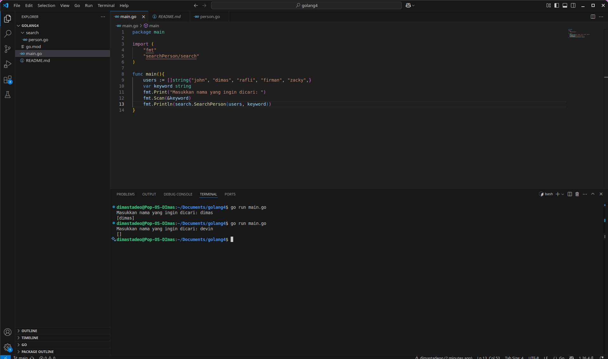

# Progam Golang pencarian nama

## berikut implementasi penggunaan function pencarian nama dari module terpisah dari main

### Screenshoot

program ini merupakan program interaktif pencarian nama, dimana pencarian data nama ada pada variabel slice di function main, sedangkan fungsi untuk mencari data ada pada module terpisah pada package search, ketika program dijalankan maka akan diminta input nama yang dicari, jika data ada akan menampilkan data slice berupa nama yang dicari, tapi jika tidak ada akan menampilkan slice kosong